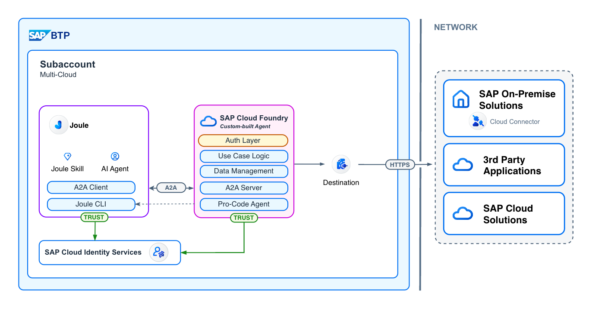

# Securing Your Pro-Code Agent: Authentication with SAP Cloud Identity Services

In the last blog post, we had a first look into integrating a Pro-Code Agent into the Joule Ecosystem. While the basic integration worked well, the example lacked proper authentication to ensure only authorized users would access it. Without authentication checks - anyone can access the Agent that would be internet-accessible. This blog will look into securing your agent using **SAP Cloud Identity Services - Identity Authentication Service (IAS)** in Python.

## Scenario



Our target is to use SAP Cloud Identity Services - Identity Authentication Service (short: IAS) to take care of the authentication. We will implement the authentication check on the Python side using middleware that validates JWT tokens from IAS.

**Important distinction**: In this blog, we focus on protecting the agent from unauthorized access using the OAuth2 Client Credentials flow. This is app-to-app authentication - we verify that the calling application (e.g., Joule) has valid credentials to access our agent. The token identifies the *application*, not the end user.

If your agent needs to call backend systems on behalf of the actual user (e.g., accessing SAP S/4HANA with the user's permissions), you'll need **Principal Propagation** - forwarding the user's identity through the call chain. That's a different pattern which I'll cover in a follow-up blog post.

By the end of this blog, you will have a secure A2A agent that validates JWT tokens and IAS configured with the necessary applications and API scopes.

## Prerequisites

For the IAS setup basics, please refer to my previous blog post: [Using IAS to Secure Python APIs on Cloud Foundry](https://community.sap.com/t5/technology-blogs-by-sap/using-ias-to-secure-python-apis-on-cloud-foundry/ba-p/13960702). That post covers:

- Creating an application in IAS
- Configuring Provided APIs (scopes like `api_read_access`)
- Creating client credentials with API permissions

For this scenario, you will need:

1. **IAS Tenant**: Access to an SAP Cloud Identity Services tenant with an application configured
2. **Client Credentials**: Client ID and Client Secret with `api_read_access` scope
3. **BTP Cloud Foundry**: A Cloud Foundry space to deploy the agent
4. **SAP AI Core**: For the agent's LLM capabilities (optional)

---

## Part 1: Understanding JWT Token Verification

Before diving into the code, let's understand what we're actually verifying. When a client authenticates with IAS using the client credentials flow, IAS returns a JWT (JSON Web Token). This token is a Base64-encoded JSON object with three parts: header, payload, and signature.

Here's what a decoded IAS token payload looks like:

```json
{
  "ias_apis": [
    "api_read_access",
    "api_write_access"
  ],
  "sub": "<your-client-id>",
  "aud": "<your-client-id>",
  "sap_id_type": "app",
  "azp": "<your-client-id>",
  "iss": "https://your-tenant.accounts.ondemand.com",
  "exp": 1775566673,
  "iat": 1775563073,
  "jti": "0324db00-39ab-4dc5-888c-11fd4959aef5"
}
```

The key fields our middleware needs to verify are: `iss` (issuer) confirms the token came from our IAS tenant, `aud` (audience) confirms the token is meant for our application, `exp` (expiration) ensures the token hasn't expired, and `ias_apis` contains the scopes we configured in IAS - this is where we check for `api_read_access`.

The token is cryptographically signed by IAS. To verify this signature, our middleware fetches the public keys from IAS's JWKS (JSON Web Key Set) endpoint at `/oauth2/certs`. This ensures nobody can forge a valid token - only IAS can create tokens that pass verification.

## Part 2: The IAS Authentication Middleware

Now let's look at the implementation. The middleware is intentionally minimal - about 50 lines of code:

```python
"""IAS Authentication Middleware for A2A Server."""

import os

import jwt
import requests
from starlette.middleware.base import BaseHTTPMiddleware
from starlette.requests import Request
from starlette.responses import JSONResponse

# Config - Load from environment variables
ISSUER = os.environ.get("IAS_ISSUER", "https://your-tenant.accounts.ondemand.com")
JWKS_URL = f"{ISSUER}/oauth2/certs"
AUDIENCE = os.environ.get("IAS_AUDIENCE", "your-client-id-here")


class IASAuthMiddleware(BaseHTTPMiddleware):
    """Validates JWT tokens from SAP IAS."""

    def get_public_key(self, token: str):
        """Fetch JWKS and find the matching public key."""
        kid = jwt.get_unverified_header(token)["kid"]
        jwks = requests.get(JWKS_URL).json()

        for key in jwks["keys"]:
            if key["kid"] == kid:
                return jwt.algorithms.RSAAlgorithm.from_jwk(key)

        raise Exception("No matching key found")

    def verify_token(self, token: str):
        """Validate JWT token and return payload."""
        public_key = self.get_public_key(token)
        payload = jwt.decode(
            token, public_key, algorithms=["RS256"],
            audience=AUDIENCE, issuer=ISSUER
        )

        if "api_read_access" not in payload.get("ias_apis", []):
            raise Exception("Missing required ias_apis scope")

        return payload

    async def dispatch(self, request: Request, call_next):
        # Allow public discovery endpoints
        if request.url.path.startswith("/.well-known/"):
            return await call_next(request)

        auth_header = request.headers.get("Authorization")

        if not auth_header or not auth_header.startswith("Bearer "):
            return JSONResponse(status_code=401, content={"detail": "Missing token"})

        token = auth_header.split(" ")[1]

        try:
            payload = self.verify_token(token)
            request.state.user = payload
        except Exception as e:
            return JSONResponse(status_code=401, content={"detail": str(e)})

        return await call_next(request)
```

The `get_public_key` method fetches the JWKS from IAS and finds the key matching the token's `kid` (key ID) header. The `verify_token` method uses PyJWT to decode and verify the token in one step - it checks the signature, issuer, audience, and expiration automatically. We then add our custom check for the `api_read_access` scope in the `ias_apis` claim. The `dispatch` method is called for every request and either lets it through (for `/.well-known/` paths) or validates the Bearer token. 

**Note:** Some endpoint are meant to be public - /.well-known/ contains the agent cards and is used for the discovery. Thus we want to exclude that from the auth checks.

---

## Part 3: Integrating with the A2A Server

Adding the middleware to your A2A server is straightforward - just one line:

```python
from a2a.server.apps import A2AStarletteApplication
from middleware.ias_auth import IASAuthMiddleware

# ... setup agent_card and request_handler ...

server = A2AStarletteApplication(
    agent_card=agent_card, http_handler=request_handler
)

# Build app and add IAS auth middleware
app = server.build()
app.add_middleware(IASAuthMiddleware)
```

### Deployment Configuration

Set the environment variables in your `manifest.yaml`:

```yaml
applications:
- name: currency-agent
  memory: 512M
  buildpack: python_buildpack
  command: uvicorn app:app --host 0.0.0.0 --port ${PORT}
  env:
    IAS_ISSUER: "https://your-tenant.accounts.ondemand.com"
    IAS_AUDIENCE: "your-client-id"
```

Deploy with:

```bash
cd app
cf push
```

---

## Part 4: Testing the Authentication

Let's verify that our authentication is working correctly.

### Step 1: Test Public Endpoint (No Auth Required)

The agent card is accessible without authentication for A2A discovery:

```bash
curl -s "https://<your-agent>.cfapps.sap.hana.ondemand.com/.well-known/agent.json" | jq '.'
```

**Response:**
```json
{
  "name": "Currency Agent",
  "description": "Helps with exchange rates for currencies",
  "version": "1.0.0",
  "protocolVersion": "0.3.0",
  "capabilities": {
    "pushNotifications": true,
    "streaming": true
  },
  "skills": [
    {
      "id": "convert_currency",
      "name": "Currency Exchange Rates Tool",
      "description": "Helps with exchange values between various currencies"
    }
  ]
}
```

### Step 2: Test Without Token (Should Fail)

```bash
curl -s "https://<your-agent>.cfapps.sap.hana.ondemand.com/" \
  -H "Content-Type: application/json" \
  -d '{"jsonrpc": "2.0", "method": "message/send", "params": {}, "id": "1"}'
```

**Response:**
```json
{
  "detail": "Missing token"
}
```

### Step 3: Get Token and Call Agent

```bash
# Get token from IAS
TOKEN=$(curl -s -X POST "https://<tenant>.accounts.ondemand.com/oauth2/token" \
  -H "Content-Type: application/x-www-form-urlencoded" \
  -d "grant_type=client_credentials" \
  -d "client_id=<client-id>" \
  -d "client_secret=<client-secret>" | jq -r '.access_token')

# Call the agent
curl -s "https://<your-agent>.cfapps.sap.hana.ondemand.com/" \
  -H "Authorization: Bearer $TOKEN" \
  -H "Content-Type: application/json" \
  -d '{
    "jsonrpc": "2.0",
    "method": "message/send",
    "params": {
      "message": {
        "role": "user",
        "parts": [{"kind": "text", "text": "What is 100 USD in EUR?"}],
        "messageId": "msg-123"
      }
    },
    "id": "1"
  }' | jq '.'
```

**Response:**
```json
{
  "id": "1",
  "jsonrpc": "2.0",
  "result": {
    "artifacts": [
      {
        "artifactId": "ad8b315f-dd87-45ca-9f5e-584439102732",
        "name": "conversion_result",
        "parts": [
          {
            "kind": "text",
            "text": "100 USD is approximately 86.77 EUR based on the current exchange rate."
          }
        ]
      }
    ],
    "contextId": "095d62bd-dfa1-4b77-991b-392fe7038ecd",
    "id": "639c1a4b-d486-45df-b4be-4b614e0c441d",
    "kind": "task",
    "status": {
      "state": "completed",
      "timestamp": "2026-04-07T11:44:14.740338+00:00"
    }
  }
}
```

---

## Part 5: Connecting to Joule

Now that your agent is secured with IAS authentication, you need to configure Joule to communicate with it via a BTP Destination.

### Create the BTP Destination

In your BTP Cockpit, create a destination for your secured agent:

1. Navigate to **Connectivity** > **Destinations**
2. Create a new destination with these settings:
   - **Name**: `CURRENCY_AGENT_IAS`
   - **Type**: `HTTP`
   - **URL**: `https://<your-agent>.cfapps.sap.hana.ondemand.com`
   - **Proxy Type**: `Internet`
   - **Authentication**: `OAuth2ClientCredentials`
   - **Client ID**: Your IAS Client ID
   - **Client Secret**: Your IAS Client Secret
   - **Token Service URL**: `https://your-tenant.accounts.ondemand.com/oauth2/token`

<!-- TODO: Add screenshot of destination configuration -->

### Test from Joule

Once the destination is configured, you can interact with the secured agent through Joule:


---

## Conclusion

With just ~50 lines of middleware code, we've secured our A2A agent with IAS authentication. The middleware validates JWT tokens from IAS, checks the required scopes, and keeps the agent discovery endpoints public for A2A protocol compliance. The full code is available on [GitHub](https://github.com/fyx99/joule-pro-code-a2a).

Remember: this setup protects your agent from unauthorized access, but the token identifies the calling *application*, not the end user. If your agent needs to access backend systems with the user's identity and permissions (think: reading a user's SAP data), you'll need Principal Propagation - that's the topic of my next blog post.

I hope you found this insightful. Feel free to leave questions in the comments!
