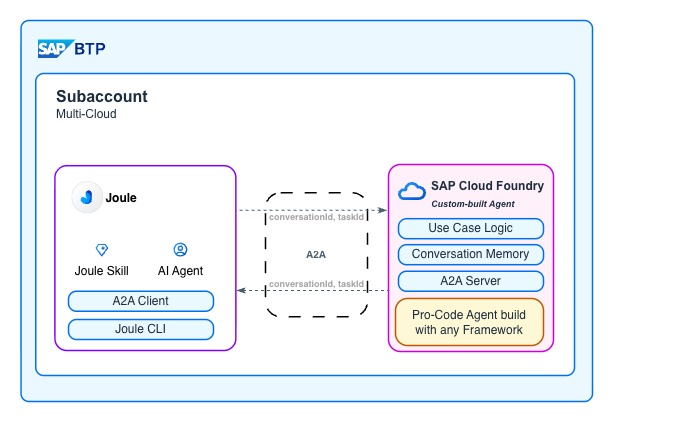
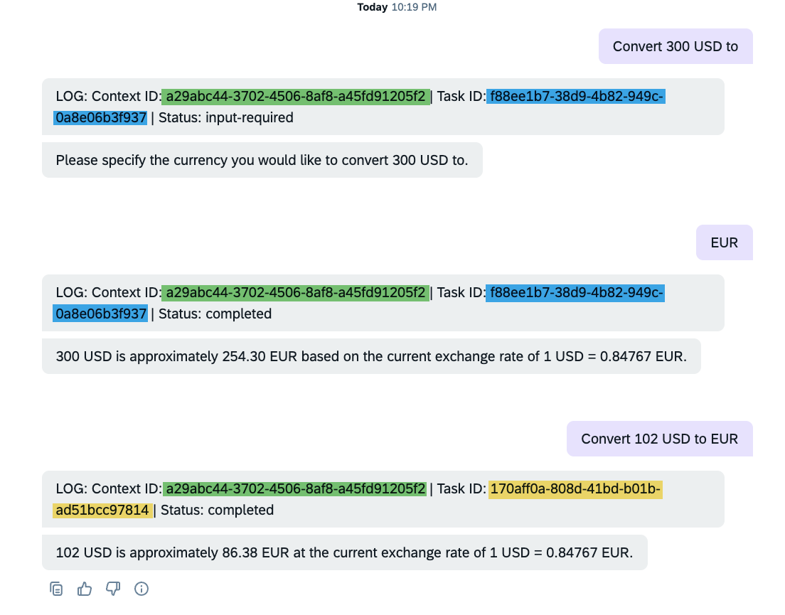

In my [first post on the Agent-to-Agent Integration with Joule](https://community.sap.com/t5/technology-blog-posts-by-sap/joule-a2a-connect-code-based-agents-into-joule/ba-p/14329279), I showed how to set up a minimal viable example. Without context handling, your agent forgets everything after each turn—making follow-up questions or clarifications impossible. This post covers how to enable multi-turn conversations between Joule and your custom agent using the A2A protocol's context management features.

## Scenario

The scenario is straightforward: we have a custom-built agent integrated with Joule. Joule is an assistant used by multiple users and capable of handling multiple conversations at the same time. If our agent is a static one—like the currency converter shown in my previous post—it's enough to handle each delegated task as an individual conversation without history. But for this blog we want to think of a scenario where the agent might need additional input from the user in multi-turn conversations. For this purpose we look at the contextId and taskId that the A2A protocol introduces, to sync the conversation context between Joule and our agent.



---

## Understanding A2A Context Management

To support multi-turn interactions, the A2A protocol introduces contextId and taskId, which together allow agents to preserve conversational continuity and manage individual units of work across multiple requests.

Think of it this way:
- **contextId** = the conversation. All messages between a user and agent that belong together share the same contextId. It's your memory key.
- **taskId** = a specific job within that conversation. One conversation can have multiple tasks, each with its own lifecycle.

```
Example Flow
│
├── "Convert 300 USD to ?" 
│     └── Task 1 (taskId: T1)
│           → input_required
│
├── "What is EUR rate?"
│     └── Task 2 (taskId: T2)
│           → completed
```

The agent creates both IDs. On the first request, neither exists—the agent generates them and returns them in the response. The client (Joule) then sends them back on subsequent requests to continue the conversation.


This separation allows clients to either continue a specific task, create a new task within an existing conversation, or manage multiple related tasks under one shared context—making A2A interactions stateful, structured, and scalable.


For multi-turn agents, tasks progress through defined lifecycle states (`working` → `input_required` → `completed`). Who manages these transitions? The agent's LLM does. When the model generates a response, it evaluates whether the user's input is sufficient to complete the task. If not, it signals `input_required` to request more information.


Find more details in the [A2A Protocol documentation](https://a2a-protocol.org/latest/topics/life-of-a-task/#group-related-interactions) 

## How Joule Implements Context Management

Joule uses the `agent-request` action type to communicate with A2A agents. This action gives us control over what parameters are included in the request body.

By default, Joule only sends the current user message that triggered the agent request—not the entire chat history. This is an important detail: your agent won't automatically see previous conversation turns unless you explicitly manage context. While you could potentially append history using capability context, the standard approach is to let the agent maintain its own memory using the context ID.

In addition to the user message, we can include `contextId` and `taskId` in the request body. Since Joule acts as an A2A client, its primary responsibility is to propagate these IDs back to the agent on subsequent requests. This is achieved using **capability context variables**—session-scoped variables that persist across multiple interactions within a Joule conversation.

One convenient detail: you might expect to need conditional logic like "if contextId is null, omit the parameter." But Joule handles empty values gracefully, so no special handling is required on the first turn when the IDs don't exist yet.

Let's look at how this works in practice.

---

## Joule Capability Configuration

The capability configuration implements the context flow described above. Here's the structure:

```
currency_agent_capability/
├── functions/
│   └── currency_agent_function.yaml
├── scenarios/
│   └── currency_agent_scenario.yaml
├── capability_context.yaml
└── capability.sapdas.yaml
```

An important point to understand: **the agent supplies the IDs, not Joule**. On the first request, Joule sends empty values. The agent generates new IDs and returns them in the response. Joule then captures these IDs and sends them back on subsequent requests.

Here's an example of the first request the agent — note that `contextId` and `taskId` are absent:

```json
{
  "jsonrpc": "2.0",
  "id": "cc09e1b1-0a32-4160-9bcb-3336227b8c05",
  "method": "message/send",
  "params": {
    "message": {
      "role": "user",
      "parts": [{"text": "Convert 300 USD to", "kind": "text"}],
      "messageId": "cc09e1b1-0a32-4160-9bcb-3336227b8c05",
      "kind": "message"
    }
  }
}
```

The agent processes this request, generates new IDs, and returns a response with `input-required` status:

```json
{
  "body": {
    "kind": "task",
    "contextId": "98fa8d22-0e99-4efe-a1a9-fff535e7db9d",
    "id": "f0d78896-0eab-472f-8a85-73050948c0a2",
    "history": [
      {
        "role": "user",
        "kind": "message",
        "parts": [{"kind": "text", "text": "What is the exchange rate for USD?"}],
        "messageId": "eb8b5afa-63cb-4cc5-9b24-38f85e782c95"
      },
      {
        "role": "agent",
        "kind": "message",
        "parts": [{"kind": "text", "text": "Looking up the exchange rates..."}]
      }
    ],
    "status": {
      "state": "input-required",
      "message": {
        "parts": [{"kind": "text", "text": "Which currency would you like to convert USD to?"}]
      }
    }
  }
}
```

Joule captures the `contextId` and task `id` from this response. On the second request, both IDs are now included:

```json
{
  "jsonrpc": "2.0",
  "id": "87cc08ae-8fc3-4d5c-a4ab-9dafd77d23a8",
  "method": "message/send",
  "params": {
    "message": {
      "role": "user",
      "parts": [{"text": "EUR", "kind": "text"}],
      "messageId": "87cc08ae-8fc3-4d5c-a4ab-9dafd77d23a8",
      "contextId": "98fa8d22-0e99-4efe-a1a9-fff535e7db9d",
      "taskId": "f0d78896-0eab-472f-8a85-73050948c0a2",
      "kind": "message"
    }
  }
}
```

### Capability Context Definition

First, we define variables to hold the context ID and task ID. These variables persist across multiple interactions within the same Joule session:

```yaml
# capability_context.yaml
variables:
  - name: agent_context_id
  - name: agent_task_id
```

### Scenario Configuration

The scenario defines which parameters flow in and which capability context variables are set with the result.

```yaml
# scenarios/currency_agent_scenario.yaml
description: The Currency Agent supports converting between different currencies.
target:
  name: currency_agent_function
  type: function
  parameters:
    - name: agent_context_id
      value: $capability_context.agent_context_id
    - name: agent_task_id
      value: $capability_context.agent_task_id

capability_context:
  - name: agent_context_id
    value: $target_result.agent_context_id
  - name: agent_task_id
    value: $target_result.agent_task_id
```

### Function Definition

The function handles the actual A2A agent request:

```yaml
# functions/currency_agent_function.yaml
parameters:
  - name: agent_context_id
    optional: true
  - name: agent_task_id
    optional: true

action_groups:
  - actions:
      - type: agent-request
        system_alias: CURRENCY_AGENT
        agent_type: remote
        body: 
          contextId: "<? agent_context_id ?>"
          taskId: "<? agent_task_id ?>"
        result_variable: "_agent_response"
      - type: message
        message:
          type: text
          content: "LOG: Context ID: <? _agent_response.body.contextId ?> | Task ID: <? _agent_response.body.id ?> | Status: <? _agent_response.body.status.state ?>"
  - condition: _agent_response.body != null && _agent_response.body.status != null && _agent_response.body.status.state == "input-required"
    actions:
    - type: message
      message:
        type: text
        content: <? _agent_response.body.status.message.parts[0].text ?>
        markdown: true
  - condition: _agent_response.body != null && _agent_response.body.artifacts != null && _agent_response.body.artifacts[0].parts != null
    actions:
    - type: message
      message:
        type: text
        content: <? _agent_response.body.artifacts[0].parts[0].text ?>
        markdown: true

result:
  agent_result: <? _agent_response ?>
  agent_context_id: "<? _agent_response != null && _agent_response.body != null && _agent_response.body.contextId != null ? _agent_response.body.contextId : '' ?>"
  agent_task_id: "<? _agent_response.body.status.state == 'completed' ? null : _agent_response.body.id ?>"
```

**Key implementation details:**

1. **Body format:** The body uses YAML object notation directly. Joule handles empty values gracefully, so no complex SpEL expression is needed for conditional taskId.

2. **Null-safe contextId extraction:** The result uses a null-safe check to avoid errors.

3. **Task state handling:** The result block sets `agent_task_id` to `null` when the status is `completed`, so the next request starts a fresh task. Otherwise, it preserves the task ID for continuation.

4. **Response routing:** Two conditional action groups handle different response types—`input-required` shows the status message (the question to the user), while `completed` shows the artifact (the final result).

The `agent_type: remote` is required for code-based (BYOA) agents.


## The Python Agent Implementation

Now let's look at how the agent code handles the context ID.

### Agent Executor

The `AgentExecutor` is where context management happens. The A2A library handles most of the heavy lifting. Here's the core of the `execute` method:

```python
# agent_executor.py
async def execute(self, context: RequestContext, event_queue: EventQueue) -> None:
    query = context.get_user_input()
    task = context.current_task

    # Create new task if none exists (first turn)
    if not task:
        task = new_task(context.message)
        await event_queue.enqueue_event(task)
    
    updater = TaskUpdater(event_queue, task.id, task.context_id)

    async for item in self.agent.stream(query, task.context_id):
        if item['require_user_input']:
            # Multi-turn: signal that we need more input
            await updater.update_status(
                TaskState.input_required,
                new_agent_text_message(item['content'], task.context_id, task.id),
                final=True,
            )
            break
        elif item['is_task_complete']:
            # Task complete: return the result as artifact
            await updater.add_artifact([Part(root=TextPart(text=item['content']))])
            await updater.complete()
            break
```

The key parts for context management:

* `new_task(context.message)` — generates a new `context_id` if none exists, or reuses the one from the incoming request
* `task.context_id` — the persistent ID that links all turns of the conversation
* `new_agent_text_message(content, task.context_id, task.id)` — every response includes both IDs
* `TaskState.input_required` — signals Joule that this is a multi-turn conversation

### The Agent with Memory

The actual agent uses LangGraph's `MemorySaver` to persist conversation state. The key insight is using the A2A `context_id` as LangGraph's `thread_id`:

```python
# agent.py
from langgraph.checkpoint.memory import MemorySaver
from langgraph.prebuilt import create_react_agent

memory = MemorySaver()

class CurrencyAgent:
    def __init__(self):
        self.graph = create_react_agent(
            self.model,
            tools=[get_exchange_rate],
            checkpointer=memory,  # Enables conversation persistence
            # ...
        )

    async def stream(self, query, context_id):
        inputs = {'messages': [('user', query)]}
        config = {'configurable': {'thread_id': context_id}}  # Links A2A context to LangGraph memory
        
        for item in self.graph.stream(inputs, config, stream_mode='values'):
            # Process streaming responses...
            yield self.process_message(item)
```

The critical connection is:

```python
config = {'configurable': {'thread_id': context_id}}
```

By using the A2A `context_id` as LangGraph's `thread_id`, all messages in the same conversation share the same memory. This is how the agent "remembers" previous turns—LangGraph automatically loads and saves the conversation state based on this ID.

Note: In this example the `task_id` is not used on the Python side—I included it in the Joule capability to demonstrate the full pattern. For synchronous interactions where one task follows another sequentially, only the `context_id` is needed for memory. The `task_id` becomes relevant for async updates or when you need to reference a specific task later.

---

## Result

With the above implementation, our Currency Agent can now ask for additional input and receive it within the same conversation context. 



This allows us to persist the sent messages on the agent server side and handle more complex scenarios that require back-and-forth interaction.

With this setup, your agent can now ask clarifying questions, gather information incrementally, and maintain context across multiple exchanges—all while Joule handles the routing and user interface. For the basic A2A integration setup, check out my [first post on Agent-to-Agent Integration with Joule](https://community.sap.com/t5/technology-blog-posts-by-sap/joule-a2a-connect-code-based-agents-into-joule/ba-p/14329279).

Note: What we have not yet seen is our agent being able to ask Joule the orchestrator or other named agents via this interface for additional input. While in pure pro-code we already are able to call other A2A capable agents, the Joule standard Agents are not yet consumable. Announced at TechEd 25 this will change soon. 

Find the full code on [Github](https://github.com/fyx99/joule-pro-code-a2a).
