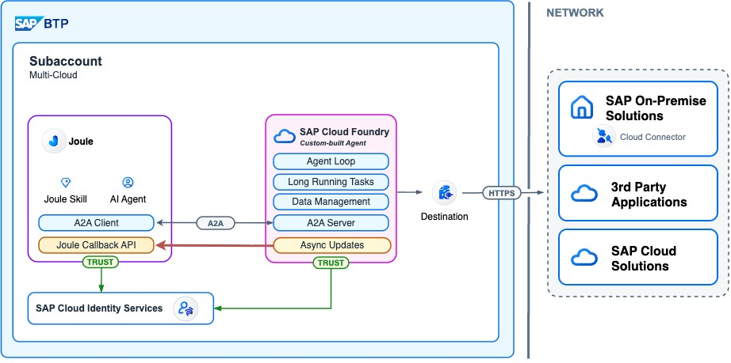

In my [previous post on multi-turn conversations with Joule](https://community.sap.com/t5/technology-blog-posts-by-sap/<PLACEHOLDER_MULTITURN_BLOG_URL>/ba-p/<PLACEHOLDER>), I showed how an A2A agent can use `contextId` and `taskId` to ask follow-up questions and stay in the conversation across turns. That works beautifully — as long as your agent answers within the synchronous request/response window.

But what happens if your agent needs to think for longer? A long-running calculation, a slow downstream system, a tool call that takes minutes, a human-in-the-loop approval step? With purely synchronous A2A, Joule waits — and eventually times out. This post covers the missing piece: **asynchronous A2A with push notifications**, where your agent acknowledges the request immediately and pushes the result back to Joule whenever it's actually ready.

The flow works, the tokens line up, and the result lands in the Joule UI as a proper assistant message. Below is the complete setup — from why you'd want this, through the IAS App2App configuration, to the Python code that ties it all together.

## Why async?

Synchronous A2A is the default — Joule sends a request to your agent, your agent processes it, returns the result, Joule shows it. Simple. But the model breaks down in a few common scenarios:

- **Long-running tools.** Your agent calls a backend that takes 30+ seconds to respond. The HTTP connection between Joule and your agent shouldn't have to stay open that long.
- **Multi-step orchestration with waits.** Your agent kicks off a workflow, polls for completion, then synthesizes a result. Total time: minutes, not seconds.
- **Human-in-the-loop.** Your agent needs an approval from someone external before it can finalize the answer. That "someone" might take an hour to click the button.

In all of these cases, you want your agent to say "got it, working on it" right away, free up the connection, and push the actual result back later. That's exactly what A2A push notifications give you, and Joule supports it on the orchestrator side.



---

## High Level Flow

```
User
↓
Joule
↓
Your Agent (CF App)
↓
Ack the request immediately (status: working)
↓
Process asynchronously (seconds, minutes, ...)
↓
Exchange the inbound user token (JWT-bearer grant)
for a JWT scoped to the Joule async API via Destination Service
↓
POST callback URL with the final result
↓
Joule receives async response → User sees it in the UI
```
It all starts with the inbound call from Joule to the agent — this is where we get the user token to hand over. The HTTP call is acknowledged by our agent — basically saying "just a sec, response is coming". And finally our agent can use Joule's callback API: given the correlation ID, the conversation ID and our user token, it lets us send a message to that specific conversation, and it appears for the user.

---

## Setup

### Prerequisites

The async setup builds on two things: first, we need a working A2A-speaking agent — I recommend you follow the [first A2A post](https://community.sap.com/t5/technology-blog-posts-by-sap/joule-a2a-connect-code-based-agents-into-joule/ba-p/14329279) for that. In addition we need the logged-in user's token — for that I recommend checking out the post on principal propagation. For simplicity I will recap the relevant steps here as well.

Plus there are some general prerequisites:

- **Access to the IAS Admin Console** of the tenant your Joule instance trusts.
- **The right user roles**: `extensibility_developer` and `capability_admin` to deploy capabilities, plus `end_user` to chat with Joule.

### IAS App2App configuration

Now let's start with the crucial configuration on the IAS side. Because the callback API requires us to authenticate, we need to set up some IAS dependencies to make that work.


1. **Create an IAS application** for the agent (I called mine `A2A_Custom_Agent_App`). This is the OAuth client that will request the exchanged JWT.

   

2. **Add a dependency** on that application pointing at the Joule async API. The dependency name is up to you — pick something descriptive (I used `agent-to-joule`). What matters is that the dependency targets the Joule API; that's what makes the exchanged JWT a valid credential for the callback URL. Whatever name you pick here is the same one that ends up in the destination's `tokenService.body.resource` field below.

   

3. **Create a client secret** on the custom agent application under *Client Authentication → Add*. Save it — IAS only shows it once.

   

   The credentials shown after creation are the `clientId` / `clientSecret` you'll plug into the destination:

   

The values you'll keep around for the destination configuration:

| What | Where it comes from |
|---|---|
| Token Service URL | `https://<your-ias-tenant>.accounts.ondemand.com/oauth2/token` |
| Client ID | Client ID of the IAS app you created in step 1 |
| Client Secret | Client secret from step 3 |
| Dependency name | The dependency you added in step 2 (e.g. `agent-to-joule`) |
| JWKS URI | `https://<your-ias-tenant>.accounts.ondemand.com/oauth2/certs` |

### Capability change: enable push notifications

To enable push notifications you need to make a small change in the YAML.
It needs one extra flag in the agent request action to tell Joule it should expect an async response from this agent:

```yaml
# functions/currency_agent_function.yaml
action_groups:
  - actions:
      - type: agent-request
        system_alias: CURRENCY_AGENT
        agent_type: remote
        body:
          contextId: "<? agent_context_id ?>"
          taskId: "<? agent_task_id ?>"
          configurations:
            pushNotifications: true   # <-- the only change vs. the sync setup
        result_variable: "_agent_response"
```

With `pushNotifications: true`, Joule does two things differently:

- It sends a `pushNotificationConfig` block in the request body, containing the **callback URL** your agent is expected to POST back to.
- It accepts an immediate `working` status from your agent without timing out, and waits for the eventual callback.

The rest of the capability — the scenario, the `capability_context` for `agent_context_id` / `agent_task_id`, the response routing for `input-required` vs. `completed` — stays identical to the [multi-turn setup](https://community.sap.com/t5/technology-blog-posts-by-sap/<PLACEHOLDER_MULTITURN_BLOG_URL>/ba-p/<PLACEHOLDER>). Async composes cleanly with multi-turn.


## What the agent receives

When push notifications are enabled, the request from Joule to your agent now includes a `pushNotificationConfig`:

```json
{
  "jsonrpc": "2.0",
  "id": "6967bf3e-a16e-4d06-93d2-2fc900dad7cb",
  "method": "message/send",
  "params": {
    "message": {
      "role": "user",
      "parts": [{"text": "convert 5 usd to eur", "kind": "text"}],
      "messageId": "6967bf3e-a16e-4d06-93d2-2fc900dad7cb",
      "contextId": "ce5e0959-fc18-4921-b7fa-8d34084b91e2",
      "kind": "message"
    },
    "configuration": {
      "pushNotificationConfig": {
        "url": "https://sapdas.<region>.sapdas.cloud.sap/api/agent/v1/callback/a2a"
      }
    }
  }
}
```

Three pieces of information your agent needs to keep around for the callback:

- The **callback URL** from `params.configuration.pushNotificationConfig.url`.
- The inbound **`Authorization: Bearer <token>`** header — this user token gets exchanged for a JWT scoped to the Joule async API.
- The HTTP headers **`conversationid`** and **`x-correlationid`** — these travel with the original request and must be echoed back on the callback so Joule can correlate the async result with the right conversation.

---

## The token flow

Two destinations are needed: one from Joule to the custom agent, and one for the way back from our agent to Joule's callback API.

### Inbound: how Joule reaches the agent

Joule itself uses a destination to call the agent. That destination lives in the **Joule subaccount** and is the entry point for every A2A request. It's an `OAuth2JWTBearer` destination — same authentication type we'll use on our side — pointed at the agent's Cloud Foundry URL, with the A2A proxy app's credentials. I call it the `CURRENCY_AGENT` destination here, but it could be any name.


Note: these credentials and the proxy app are created in the previous blog — please refer to part 1 and 2 of my principal propagation blog post.

### Outbound: how the agent calls Joule back

To call Joule's async callback, we need a JWT that has access to the Joule API. This goes through the Joule IAS app. The interesting pattern here: the Joule `das-ias` IAS app is SAP-owned/managed, which means we cannot create client credentials on it. Instead we use our own app and create a dependency on it. That's where the A2A custom agent app comes in — from the inbound flow we get a token for that A2A custom agent IAS app, and we need to exchange it for one valid against the Joule app.

There are two ways to do that exchange: do it yourself in the agent, or let the **BTP Destination Service** handle it. We'll go with the destination service: less code, IAS credentials stay out of the agent's environment, and rotating the secret is easier. 

### The destination

In the BTP cockpit (or via the destination-configuration REST API), create an HTTP destination with `Authentication: OAuth2JWTBearer`. The full JSON shape:

```json
{
  "Name": "JOULE_ASYNC_API",
  "Type": "HTTP",
  "URL": "https://sapdas.<region>.sapdas.cloud.sap/api/agent/v1/callback/a2a",
  "ProxyType": "Internet",
  "Authentication": "OAuth2JWTBearer",
  "tokenServiceURL": "https://<your-ias-tenant>.accounts.ondemand.com/oauth2/token",
  "tokenServiceURLType": "Dedicated",
  "clientId": "<APP2APP_CLIENT_ID>",
  "clientSecret": "<APP2APP_CLIENT_SECRET>",
  "tokenService.body.resource": "urn:sap:identity:application:provider:name:agent-to-joule",
  "tokenService.body.token_format": "jwt",
  "tokenService.addClientCredentialsInBody": "true",
  "x_user_token.jwks_uri": "https://<your-ias-tenant>.accounts.ondemand.com/oauth2/certs",
  "HTML5.DynamicDestination": "true"
}
```


A few of these fields are not optional — they are exactly the difference between a working destination and a generic `Retrieval of OAuthToken failed due to: unexpected error`:

| Field | Why it has to be there |
|---|---|
| `tokenService.body.resource` | The audience of the exchanged JWT — must be `urn:sap:identity:application:provider:name:<APP2APP_DEPENDENCY>` (or the `clientid` URN variant). Without it the destination service has no idea which provider app to exchange against. |
| `tokenService.body.token_format` = `"jwt"` | Forwarded by the destination service into the exchange request body. Without it IAS issues an opaque token that the DAS app router rejects with a generic `400 Bad Request`. |
| `tokenService.addClientCredentialsInBody` = `"true"` | Sends `client_id`/`client_secret` in the form body instead of as Basic Auth. Several IAS app configurations only accept the body variant for the JWT-bearer grant. |
| `x_user_token.jwks_uri` | The JWKS endpoint of the IAS tenant that issued the inbound user token. The destination service uses it to validate the `X-user-token` before exchanging. **Missing this is the root cause of the `unexpected error`** — there's no other diagnostic. |

### Calling the destination

With the destination in place, getting the callback token is two HTTP calls:

```bash
# 1. Service token for the Destination Service (XSUAA, client credentials)
DEST_TOKEN=$(curl -s -X POST "$DEST_TOKEN_URL" \
  --user "$DEST_CLIENT_ID:$DEST_CLIENT_SECRET" \
  -d "grant_type=client_credentials" | jq -r .access_token)

# 2. Find the destination, passing the inbound user JWT as X-user-token
curl -s -X GET "$DEST_SERVICE_URL/destination-configuration/v1/destinations/JOULE_ASYNC_API" \
  -H "Authorization: Bearer $DEST_TOKEN" \
  -H "X-user-token: $INBOUND_USER_JWT"
```
Here we do a toy example with curl.
The response carries the resolved destination plus the exchanged token under `authTokens[0]`:

```json
{
  "destinationConfiguration": {
    "URL": "https://sapdas.<region>.sapdas.cloud.sap/api/agent/v1/callback/a2a",
    "...": "..."
  },
  "authTokens": [
    {
      "type": "Bearer",
      "value": "eyJqa3UiOi...",
      "http_header": {
        "key": "Authorization",
        "value": "Bearer eyJqa3UiOi..."
      },
      "expires_in": "3600"
    }
  ]
}
```

Decoding the JWT in `authTokens[0].value` shows the user identity still in there — `sap_id_type: "user"`, the user's `email`, `ias_apis: ["joule-api"]`, and the `aud` set to the Joule app. And this is exactly what we need.

### Posting the callback

We can also test the callback directly with curl:
```bash
curl -X POST "$(jq -r .destinationConfiguration.URL <<<"$DEST_RESPONSE")" \
  -H "Authorization: $(jq -r '.authTokens[0].http_header.value' <<<"$DEST_RESPONSE")" \
  -H "Content-Type: application/json" \
  -H "conversationid: <FROM_INBOUND_REQUEST>" \
  -H "x-correlationid: <FROM_INBOUND_REQUEST>" \
  -d '{
    "id": "<x-correlationid value>",
    "jsonrpc": "2.0",
    "result": {
      "id": "<taskId>",
      "status": {
        "state": "completed",
        "message": {
          "messageId": "msg-001",
          "kind": "message",
          "role": "agent",
          "parts": [{"kind": "text", "text": "Status message"}]
        }
      },
      "contextId": "<contextId>",
      "kind": "task",
      "artifacts": [
        {
          "artifactId": "result-001",
          "parts": [{"kind": "text", "text": "Final result for the user"}]
        }
      ]
    }
  }'
```

The body wraps the A2A `Task` in a JSON-RPC envelope. The `result.status.state` can be `working` (intermediate update), `input-required` (multi-turn), or `completed` (done). The `result.artifacts` carry the final answer that ends up in the Joule UI.

## Putting it in Python

Two small things change vs. the multi-turn agent — everything else (`agent.py`, the agent card, manifest) stays the same.

```
a2a_multiturn_async/app/
├── agent.py               # unchanged
├── agent_executor.py      # CHANGED — fire-and-forget background task
├── joule_client.py        # NEW    — destination-service exchange + envelope builders
├── app.py                 # unchanged shape (just push_notifications=True on the AgentCard)
└── manifest.yaml
```

The full code is on [GitHub](https://github.com/fyx99/joule-pro-code-a2a) — here I'll just call out the bits that are actually new.

### `agent_executor.py` — return immediately, push later

The synchronous executor would `await` the agent's stream and enqueue events. The async one schedules the work as a background asyncio task and returns right away, so the SDK can answer Joule's HTTP request with a 200. The user JWT and the two correlation headers come straight off the inbound `RequestContext` — same trick as in the principal-propagation post:

```python
# agent_executor.py — only the new bits
def _extract_request_state(context: RequestContext) -> tuple[str, str, str]:
    headers = context._call_context.state.get("headers", {}) if context._call_context else {}
    auth = headers.get("authorization", "")
    user_jwt = auth[len("Bearer "):] if auth.lower().startswith("bearer ") else ""
    return user_jwt, headers.get("conversationid", ""), headers.get("x-correlationid", "")


async def execute(self, context, event_queue):
    task = context.current_task or new_task(context.message)
    await event_queue.enqueue_event(task)

    user_jwt, conversation_id, correlation_id = _extract_request_state(context)

    # Decouple the long-running work from the inbound request — SDK returns 200
    # immediately, results come back through Joule's async callback URL.
    bg = asyncio.create_task(
        self._push_results(task, context.get_user_input(),
                           user_jwt, conversation_id, correlation_id),
    )
    self._background_tasks.add(bg)
    bg.add_done_callback(self._background_tasks.discard)
```

Two things worth flagging:

- **Hold on to the background task.** `asyncio.create_task` returns a weakly-referenced task; if you don't keep a reference, the GC can collect it mid-flight. The `_background_tasks` set is the standard fix.
- **Why not the SDK's `BasePushNotificationSender`?** The A2A SDK ships one, and it does the right thing for vanilla A2A — `DefaultRequestHandler` calls it automatically when the executor emits task events, and it POSTs `task.model_dump()` to the registered `pushNotificationConfig.url`. Two reasons it doesn't fit Joule's flavour out of the box: (1) Joule expects the task wrapped in a **JSON-RPC envelope** (`{id, jsonrpc, result: <task>}`), not the bare task; (2) the callback needs a destination-service-exchanged Bearer plus the original `conversationid` / `x-correlationid` headers — none of which are reachable from inside `_dispatch_notification`, because by then the inbound `RequestContext` is gone. You can bridge that with a Starlette middleware + `ContextVar`, but pushing directly from the executor — which still has the full request state — keeps it simpler.

The `_push_results` body just iterates `agent.stream(...)` and calls `joule_client.post_callback(...)` for each step, picking the right envelope (`working` / `input-required` / `completed`) based on the step type.

### `joule_client.py` — destination service + JSON-RPC envelopes

This is the only fully new file. Two responsibilities, kept side by side:

**1. Destination-service exchange.** Same shape as `s4_client.py` from the [principal propagation post](https://community.sap.com/t5/technology-blog-posts-by-sap/<PLACEHOLDER_PP_BLOG_URL>/ba-p/<PLACEHOLDER>) — get a service token, then resolve the destination with `X-user-token`. The destination service runs the JWT-bearer exchange against IAS for us:

```python
# joule_client.py
async def _resolve_destination(http, user_jwt):
    dest_token = await _get_dest_service_token(http)   # client-credentials
    r = await http.get(
        f"{DEST_SERVICE_URL}/destination-configuration/v1/destinations/{DEST_NAME}",
        headers={"Authorization": f"Bearer {dest_token}", "X-user-token": user_jwt},
    )
    r.raise_for_status()
    return r.json()   # carries authTokens[0].value = exchanged Joule-API JWT
```

**2. JSON-RPC envelope builders.** Joule expects the A2A `Task` wrapped in JSON-RPC, with a state of `working`, `input-required`, or `completed`. Three tiny helpers cover all three:

```python
def completed_envelope(task_id, context_id, correlation_id, message):
    """Final result — `artifacts` is what shows up in Joule as the assistant message."""
    return {
        "id": correlation_id or task_id,
        "jsonrpc": "2.0",
        "result": {
            "id": task_id, "contextId": context_id, "kind": "task",
            "status": {"state": "completed"},
            "artifacts": [{
                "artifactId": f"result-{task_id}",
                "parts": [{"kind": "text", "text": message}],
            }],
        },
    }
# working_envelope / input_required_envelope are the same shape with a different status block
```

And the actual POST — pull URL + Authorization header out of the destination response, echo `conversationid` and `x-correlationid` so Joule routes the result to the right conversation:

```python
async def post_callback(http, user_jwt, conversation_id, correlation_id, body):
    dest = await _resolve_destination(http, user_jwt)
    auth_tokens = dest.get("authTokens") or []
    callback_url = dest["destinationConfiguration"]["URL"]
    headers = {
        auth_tokens[0]["http_header"]["key"]: auth_tokens[0]["http_header"]["value"],
        "Content-Type": "application/json",
        "conversationid": conversation_id,
        "x-correlationid": correlation_id,
    }
    return await http.post(callback_url, json=body, headers=headers)
```

That's it for the moving parts: a few extra lines in the executor to fork off the work, plus one client module for the destination-service dance and the envelope shape. The agent itself doesn't even know it's running async.

### `app.py` — one flag on the agent card

The only change in `app.py` is on the `AgentCard`:

```python
capabilities=AgentCapabilities(streaming=True, push_notifications=True),
```

No middleware, no custom push sender wired into the request handler — just the standard `DefaultRequestHandler` with `InMemoryTaskStore`. The async behaviour is fully encapsulated in the executor.

### `manifest.yaml` — the destination-service binding

The only new env block on top of the multi-turn manifest is the destination-service credentials (so `joule_client.py` can call it):

```yaml
env:
  DEST_SERVICE_URL:    "https://destination-configuration.cfapps.<region>.hana.ondemand.com"
  DEST_TOKEN_URL:      "https://<subaccount>.authentication.<region>.hana.ondemand.com/oauth/token"
  DEST_CLIENT_ID:      "<from dest-service service-key>"
  DEST_CLIENT_SECRET:  "<from dest-service service-key>"
  DEST_NAME:           "JOULE_ASYNC_API"
```

---

## Status updates and timeout rules

A few rules of thumb:

- **Short tasks**: status updates are optional. You can stay quiet and just push the final `completed` task at the end.
- **Long-running tasks**: send an intermediate `working` status update periodically to keep the conversation alive in Joule's view — something like "Still computing exchange rates…". I tested this with updates every ~30 seconds and ran a single task well past 10 minutes without Joule timing out. The exact thresholds are up to the Joule platform and may change over time, so don't hard-code them — just push heartbeats often enough to be safe.
- **States you'll use**: `working` (still going), `input-required` (multi-turn — pause and ask the user), `completed` (done — artifact lands in the UI).

Multi-turn composes cleanly with async: an `input-required` push notification will show up in Joule UI as a question to the user, and the user's reply comes back as a normal A2A request with the same `contextId` and `taskId`.


## Testing the async response

Sending `convert 5 usd to eur` from Joule and watching the CF logs of the agent shows the full async lifecycle in five lines:

```
agent_executor: configuration=PushNotificationConfig(
   url='https://sapdas.<region>.sapdas.cloud.sap/api/agent/v1/callback/a2a')
httpx: HTTP Request: GET  https://api.frankfurter.dev/v1/latest?from=USD&to=EUR  → 200 OK
httpx: HTTP Request: POST https://<ias-tenant>.accounts.ondemand.com/oauth2/token → 200
token_exchange: Token exchanged for Joule async-api JWT (expires_in=3600s)
httpx: HTTP Request: POST https://sapdas.<region>.sapdas.cloud.sap/api/agent/v1/callback/a2a → 200 OK
push_sender: Push notification sent for task_id=029b5be9-… to https://sapdas.<region>.sapdas.cloud.sap/api/agent/v1/callback/a2a
```

Inbound request carries the `pushNotificationConfig`, the agent does its work, the inbound user token is exchanged for a Joule-API JWT, and the callback is posted with `200 OK` from the DAS app router.

And on the Joule UI side:


The user message goes in, the agent acks immediately (Joule shows a "working" indicator), and the final result lands in the conversation as a regular assistant message — no different from the synchronous case, just decoupled in time.


## Conclusion

With async A2A in place, the design space for Joule-integrated agents opens up considerably. You're no longer constrained to "must finish within an HTTP timeout" — your agent can take its time, do real work, hit slow systems, wait for humans, and still deliver the result through the same conversational interface. In general, agents are running longer and longer, and patterns are becoming relevant where execution is rather system-triggered with feedback not in minutes but hours, days or weeks later. For those cases the architecture would shift in general from such a conversational agent to one running in the background.

Find the full code on [GitHub](https://github.com/fyx99/joule-pro-code-a2a) under `a2a_multiturn_async/`. 

Hope you enjoyed the post and feel free to leave a comment.
