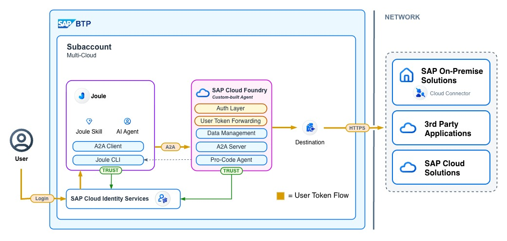

# Principal Propagation for Joule Pro-Code Agents: from Joule into S/4HANA

When AI agents move from proof-of-concept into production, a few qualities stop being optional. Propagating the user identity through the call chain is one of them. With Joule's Pro-Code Extensibility, customers can now plug their own agents into the Joule ecosystem - and the very first question that comes up is: how do I make sure the logged-in user in Joule is the same user that ends up calling the backend API?

This post walks through the end-to-end setup: from the Joule-managed IAS application all the way into S/4HANA Public Cloud, with a custom A2A agent in the middle. The result is an agent that holds **no long-lived backend credentials of its own** - every backend call is executed against the real, logged-in user's permissions.

> **Note:** With the Joule changes announced at SAPphire 2026, parts of this setup will simplify - especially the upcoming Joule Studio is expected to remove some of the manual steps. The A2A integration itself stays. Treat this post as a snapshot of how it works today, in a customer-managed Joule formation.



## Scenario

The setup follows directly from my previous posts: Joule (customer-managed) on a BTP subaccount, plus a custom A2A agent that we built ourselves. If you haven't seen those, [start here](https://community.sap.com/t5/technology-blogs-by-sap/integrating-a-custom-built-agent-into-joule-using-the-a2a-protocol/ba-p/14148702) for the baseline integration and [here](https://community.sap.com/t5/technology-blogs-by-sap/securing-your-pro-code-agent-authentication-with-sap-cloud-identity/ba-p/14150123) for the IAS-based authentication of the agent itself.

What's new in this post is what happens **inside** the agent: instead of calling some toy currency API, the agent calls a real S/4HANA Public Cloud API - the Business Partner OData service - on behalf of the user. Concretely we trigger the standard Businesspartner API in the `SAP_COM_0008` communication scenario.

We focus on S/4 Public Cloud here, but the way how to retrieve the users JWT from Joule is relevant for other scenarios as well when you might want to connect to SuccessFactors, S/4HANA Private Cloud Edition and even SAP ECC.

## High-level flow

Two token exchanges happen between the user typing a question and S/4 returning data. They look complex on paper but each one has a precise reason.

```
User in Joule  (logged in via IAS)
│
▼  JWT Bearer App2App exchange
A2A Proxy IAS App
│
▼  JWT Bearer App2App exchange
Custom Agent IAS App
│
▼
Custom A2A Agent (Cloud Foundry)
│
▼  SAML 2.0 Bearer Assertion via BTP Destination Service
S/4HANA Public Cloud  — authorizes against the real user's permissions
```

The reason for the two-step IAS exchange comes down to one constraint: **the Joule IAS application is SAP-managed**. We can't add client credentials to it, and we can't add arbitrary dependencies. So we introduce an intermediate **A2A Proxy App** that we *do* control, let Joule do the first exchange into it (which it does for us automatically), and then do the second exchange ourselves into the IAS app that represents our agent. Two hops, but each hop sits on an IAS application boundary that we own.

The second part - the SAML Bearer flow into S/4 - is the well-established way of getting from a BTP-issued user token into an S/4 OAuth token. The BTP Destination Service does this for us; we just configure it.

---

## Part 1: IAS Configuration

We need two IAS applications in our IAS tenant. For that we log into the IAS tenant that's trusted by the Joule subaccount. Log into the admin panel of that tenant (typically `<tenant>.accounts.ondemand.com/admin`) and navigate to **Applications & Resources → Applications**.


### A2A Proxy App

This app is the entry point of our A2A app-to-app exchanges. Joule will exchange its token to this app first.

Hit **Create**, name it `A2A_Proxy_App`, and choose OpenID Connect.


In addition, expose an API on it - for example `a2a_proxy_app_api`. The exposed APIs are what other apps' tokens will end up audienced for once they exchange against this app.


### Custom Agent App

Now repeat the same with a second application - `A2A_Custom_Agent_App`. This one represents our actual agent and is the second step of the chain.


Again expose an API on it - e.g. `a2a_custom_agent_app_api`.


So far nothing crazy. The interesting bit is how they're connected.

### Dependencies between the apps

In the IAS world, **dependencies** define which app-to-app token exchanges are allowed. If app A has a dependency to app B, a token of A can be exchanged for a token of B. We need two dependencies in our chain.

**1. Joule → Proxy.** On the existing Joule IAS app (usually called `das-ias-<subdomain>`) we add a dependency to the proxy app. The name **must** be `joule-to-proxy` - this exact name is what Joule looks for at runtime.


Pick the previously created `A2A_Proxy_App` from the dropdown and select its exposed API.


**2. Proxy → Custom Agent.** Second dependency, this time on the proxy app itself, pointing to the custom agent app. Here the name is your choice - pick something meaningful like `proxy-to-target`. **Remember that name** - it has to match a property in the destination configuration we'll create in a minute.


> A nice property of this setup: the proxy app is **reusable across use cases**. The `joule-to-proxy` dependency is unique per Joule tenant, but for every additional custom agent you add later, you only create a new agent IAS app and a new `proxy-to-...` dependency on the existing proxy app.

### Client credentials for the proxy app

The proxy app's client credentials will be used by the BTP Destination Service to perform the second exchange. On the proxy app, navigate to **Client Authentication** and add a new secret.


Give it a name and tick all the relevant boxes (OIDC, all token-related options).


You'll get a client ID and secret. Note them down - we need them in the destination next.


---

## Part 2: The Destination from Joule to the Agent

In my previous posts the destination toward the agent used either `NoAuthentication` or `ClientCredentials`. This time we use `OAuth2JWTBearer`, and we add the magic properties that will allow Joule to do the additional token exchange outlined.

```
Name=BUSINESS_PARTNER_AGENT
Type=HTTP
ProxyType=Internet
Authentication=OAuth2JWTBearer
URL=<your-agent-url>
clientId=<A2A_Proxy_App client id>
clientSecret=<A2A_Proxy_App client secret>
tokenServiceURL=https://<your-ias-tenant>/oauth2/token
tokenServiceURLType=Dedicated

# additional properties
apptoapp=true
tokenService.body.token_format=jwt
x_user_token.jwks_uri=https://<your-ias-tenant>/oauth2/certs
tokenService.body.resource=urn:sap:identity:application:provider:name:proxy-to-target
tokenService.body.client_id=<A2A_Proxy_App client id>
tokenService.addClientCredentialsInBody=false
```

A few things worth pointing out:

- **The credentials are those of the proxy app**, not of the agent app. This destination performs the *second* exchange (proxy → custom agent). Joule does the first one (Joule → proxy) for us before this destination is even resolved.
- **`tokenService.body.resource`** is what selects the dependency - the value `urn:sap:identity:application:provider:name:proxy-to-target` references the dependency name we created above. If you named your dependency differently, change it here.
- **`x_user_token.jwks_uri`** tells the destination service where to fetch IAS's public keys to validate the inbound user token. Without this, the second exchange silently falls back to a technical-user token and principal propagation breaks.
- **`apptoapp=true`** is what flips this destination into app-to-app mode in the first place.

The destination is the single most important piece in this setup. Get the additional properties exactly right.

### A first end-to-end test

At this point we can already test the IAS+destination setup without writing any new code. Deploy a baseline A2A Agent - for example the Currency Agent from my first blog and make sure to log the context properties in the Agent Executor.
```python
        # Log all properties of the context and task objects
        logger.info(f"Context properties: {vars(context)}")
        logger.info(f"Task properties: {vars(task)}")
````
These lines would log the user token when asking Joule something. In the agent logs you should see an `Authorization: Bearer <jwt>` header arriving with each call.

When you decode that JWT, the payload looks like this:

```json
{
  "ias_apis": ["a2a_custom_agent_app_api"],
  "sub": "P000003",
  "mail": "felix.bartler@sap.com",
  "iss": "https://<your-ias-tenant>/",
  "aud": "<custom-agent-app client id>",
  "scim_id": "be67fc7e-eb03-4422-bc3f-57f0646f090c",
  "azp": "<proxy-app client id>",
  "exp": 1781193148,
  "iat": 1781189548
}
```

That's our user identity, signed by IAS, audienced for the custom agent app. The first half of the chain works. You can see the email attribute of my user - this is important because it need to map somehow to the user available in S4 in the end. We even see the specific API on which we created the dependency on. A nice byproduct - because we can use that ias_apis scope now to check it the user is allowed to use our agent at all.

---

## Part 3: S/4HANA Public Cloud configuration for SAML Bearer

Now we turn to the second half: from the custom agent into S/4. We use the **OAuth 2.0 SAML Bearer Assertion** flow, which is the recommended way to get from a BTP-issued user token into an S/4 OAuth token. This part follows the [official SAP help page](https://help.sap.com/docs/connectivity/sap-btp-connectivity-cf/configuration-tasks#loio6e5e004b6553403486a03da53bfcaf4e__oauth) very closely - a similar setup also works for SuccessFactors, S/4 Private Cloud, and a number of other systems.

### Generate destination trust on BTP

The S/4 system needs to trust the entity that creates the SAML assertion - and that entity is the BTP subaccount's destination service. In your BTP subaccount, navigate to **Destinations → Destination Trust** and (if there is no SAML IDP trust yet) click **Generate Trust**. Download the `.pem` certificate that's generated.


### Create a communication user in S/4

In the S/4 app **Maintain Communication Users**, create a new user. I named mine `A2A_CUSTOM_AGENT`. The username and password aren't really used at runtime in the SAML Bearer flow, but the comm system requires having a user to bind to and the destination will use them too.


### Create a communication system

In **Maintain Communication Systems** create a new system - again I'm calling mine `A2A_CUSTOM_AGENT`.


For host, logical system and business system you can put placeholder values (e.g. `dummy`) - this is an outbound-system definition for our inbound API calls, so the host doesn't matter.


Now the important part: enable **OAuth 2.0 Identity Provider** and upload the certificate you downloaded from BTP.


Then there's one slightly weird manual step: from the **Signing Certificate Subject** field copy the CN value (looks like `cfapps.sap.hana.ondemand.com/a352a17b-...`) and paste it into the **Provider Name** field.

Finally, under **Users for Inbound Communication** add the comm user we created. Make sure to add it **after** activating the OAuth IdP - the S/4 UI is not stateless and the order matters. Add it as `Username and Password` initially; once you save, S/4 will automatically also register the user for `OAuth 2.0 (Confidential Client / SAML 2.0 Bearer Assertion)` - which is exactly what we want.


### Create a communication arrangement

Communication arrangements bind a comm system to a specific API scenario. In **Maintain Communication Arrangements** click **New** and pick scenario `SAP_COM_0008` (the Business Partner scenario). I named mine `SAP_COM_0008_A2A_CUSTOM_AGENT`.


In the new arrangement, link it to the `A2A_CUSTOM_AGENT` communication system. You can deactivate the replication services - we just need the inbound API.


In the OAuth section, S/4 will show you the **token service URL** of this arrangement - copy it, we need it in the next step.


### Destination from BTP to S/4

The last config piece is a destination on the BTP side. This is the destination our agent will resolve via the destination service - and which produces the S/4 OAuth token via SAML Bearer.


```
Name=S4_PUBLIC_SAML
Type=HTTP
ProxyType=Internet
Authentication=OAuth2SAMLBearerAssertion
URL=https://my300117-api.s4hana.cloud.sap
Audience=https://my300117.s4hana.cloud.sap        # see note below
Client Key=A2A_CUSTOM_AGENT                       # comm user name
Token Service URL=https://my300117-api.s4hana.cloud.sap/sap/bc/sec/oauth2/token
Token Service User=A2A_CUSTOM_AGENT
Token Service Password=<comm user password>
authnContextClassRef=urn:oasis:names:tc:SAML:2.0:ac:classes:X509
userIdSource=mail
nameIdFormat=urn:oasis:names:tc:SAML:1.1:nameid-format:emailAddress

# additional property
x_user_token.jwks_uri=https://<your-ias-tenant>/oauth2/certs
```

A couple of notes:

- **Audience** is your S/4 server URL **without** the `-api` part (so `my30xxxxx.s4hana.cloud.sap`, not `my30xxxxx-api...`). You can get it from the S/4 UI by clicking your profile picture → Settings → copying the `Server` field.
- **`userIdSource=mail`** is what tells the destination service to take the `mail` claim from the inbound IAS JWT and use it as the SAML subject. So for this to work, the user in IAS must have the same email as a (mapped) S/4 user. There are alternatives (e.g. `loginName`), but mail is the cleanest in most setups.
- **`x_user_token.jwks_uri`** appears here too - and again, without it the destination service falls back to a technical-user assertion and you lose principal propagation.

### Dry-run the S/4 Setup

Before we touch any agent code, it's worth verifying the SAML Bearer flow in isolation. The four-steps below is also exactly what our Python code is going to replicate.

**Step 1 - get an IAS user token directly** (simulating the user login in Joule):

```bash
export USER_JWT="$(curl -s -X POST \
  'https://<your-ias-tenant>/oauth2/token' \
  --data 'grant_type=password' \
  --data 'client_id=<custom-agent-app client id>' \
  --data 'client_secret=<custom-agent-app client secret>' \
  --data 'username=user@example.com' \
  --data 'password=...' \
  --data 'token_format=jwt' | jq -r .access_token)"
```
Here just use your existing Joule User - important - its email has to be present with a user in S4.

**Step 2 - get a destination service token** (client credentials from the destination service binding):

```bash
export DEST_TOKEN="$(curl -s -X POST \
  'https://<subdomain>.authentication.<region>.hana.ondemand.com/oauth/token' \
  --user '<dest-service client id>:<dest-service client secret>' \
  --data 'grant_type=client_credentials' | jq -r .access_token)"
```
Just a regular token from the destination service retrieved.

**Step 3 - resolve the destination, passing the user token** - the destination service does the SAML Bearer exchange against S/4:

```bash
DEST_RESPONSE=$(curl -s \
  "https://destination-configuration.cfapps.<region>.hana.ondemand.com/destination-configuration/v1/destinations/S4_PUBLIC_SAML" \
  -H "Authorization: Bearer $DEST_TOKEN" \
  -H "X-user-token: $USER_JWT")

export S4_TOKEN=$(echo "$DEST_RESPONSE" | jq -r '.authTokens[0].value')
```
Here pass again the destination services token. Additionally with X-user-token we pass our original simularted "Joule" Token. You get a opaque token back (so a token without any content - just acting as a key to a session).

**Step 4 - call the Business Partner API as the user**:

With this token we can now call the BP API as part of the Auth header.

```bash
curl -s -w "\nHTTP %{http_code}\n" \
  "https://my30xxxx-api.s4hana.cloud.sap/sap/opu/odata/sap/API_BUSINESS_PARTNER/A_BusinessPartner?\$top=2&\$format=json&\$select=BusinessPartner,BusinessPartnerName" \
  -H "Authorization: Bearer $S4_TOKEN" | jq '.d.results'
```

If everything is configured correctly, you'll get back business partner records that the user is *actually authorized to see* in S/4. Their role assignments in S/4 are what's filtering the data here - not anything in BTP, not anything in Joule.

---

## Part 4: The Agent Implementation

Now we tie it all together. The custom agent receives the IAS user token in the inbound A2A request, and we need to forward that token through to the destination service when calling S/4. Surprisingly little code is needed.

Three things change compared to the baseline currency agent from the [first blog post](https://community.sap.com/t5/technology-blogs-by-sap/integrating-a-custom-built-agent-into-joule-using-the-a2a-protocol/ba-p/14148702):

1. Pull the user JWT out of the inbound A2A request in the executor.
2. Thread it down to the tool via LangGraph's `RunnableConfig`.
3. In the tool, call the destination service to do the SAML Bearer exchange and then the actual S/4 API call.

### Step 1: Extract the user token from the A2A context

The A2A SDK exposes the inbound HTTP headers via `context._call_context.state["headers"]`. In `agent_executor.py`, right before kicking off the agent stream:

```python
# Pull the IAS user token out of the A2A RequestContext.
# It comes from the Authorization header that Joule sent to us.
user_jwt = None
try:
    headers = context._call_context.state.get("headers", {})
    auth = headers.get("authorization", "")
    if auth.lower().startswith("bearer "):
        user_jwt = auth[len("bearer "):]
except AttributeError:
    logger.warning("No call_context on RequestContext - running without user token")

async for item in self.agent.stream(query, task.context_id, user_jwt=user_jwt):
    ...
```

Passing the user_jwt into the agent.stream allows us to use it subsequently.

### Step 2: Thread the token to the tool via RunnableConfig

LangGraph has a built-in pattern for this: anything you put under `config["configurable"]` is reachable in any tool that declares a `RunnableConfig` parameter.

```python
# agent.py - inside stream()
async def stream(self, query, context_id, user_jwt: str | None = None):
    inputs = {'messages': [('user', query)]}
    config = {
        'configurable': {
            'thread_id': context_id,
            'jwt': user_jwt,   # picked up by every tool that declares config: RunnableConfig
        }
    }
    for item in self.graph.stream(inputs, config, stream_mode='values'):
        ...
```

And the tool reads it cleanly out of the config - Langchain specifics here on how to pass the variable cleanly to the tool execution:

```python
from langchain_core.runnables import RunnableConfig
from langchain_core.tools import tool
from s4_client import call_business_partner_api


@tool
def get_business_partners(
    top: int = 10,
    filter_expr: str | None = None,
    config: RunnableConfig = None,
) -> dict:
    """Query business partners from S/4HANA on behalf of the logged-in user."""
    jwt = (config or {}).get("configurable", {}).get("jwt")
    if not jwt:
        return {"error": "No user JWT in tool context."}
    try:
        return {
            "business_partners": call_business_partner_api(
                jwt, top=top, filter_expr=filter_expr,
            )
        }
    except Exception as e:
        return {"error": f"S/4 call failed: {e}"}
```

### Step 3: The destination service call

Now that we have the token in the tool, we essentially run the same requests we did in the curl dry run now in Python - `s4_client.py`:

```python
import os
import requests

DEST_SERVICE_URL   = os.environ["DEST_SERVICE_URL"]
DEST_TOKEN_URL     = os.environ["DEST_TOKEN_URL"]
DEST_CLIENT_ID     = os.environ["DEST_CLIENT_ID"]
DEST_CLIENT_SECRET = os.environ["DEST_CLIENT_SECRET"]
DEST_NAME          = os.environ.get("DEST_NAME", "S4_PUBLIC_SAML")


def _get_dest_service_token() -> str:
    """Client-credentials token for the Destination Service."""
    r = requests.post(
        DEST_TOKEN_URL,
        data={"grant_type": "client_credentials"},
        auth=(DEST_CLIENT_ID, DEST_CLIENT_SECRET),
        timeout=10,
    )
    r.raise_for_status()
    return r.json()["access_token"]


def _resolve_destination(user_jwt: str) -> dict:
    """Resolve the destination using X-user-token.

    The Destination Service:
      1. Validates the IAS token (jwks_uri from the additional properties)
      2. Extracts the user from the mail claim (userIdSource=mail)
      3. Generates a SAML assertion with the user identity
      4. Exchanges the SAML assertion for an S/4 OAuth token
    """
    dest_token = _get_dest_service_token()
    r = requests.get(
        f"{DEST_SERVICE_URL}/destination-configuration/v1/destinations/{DEST_NAME}",
        headers={
            "Authorization": f"Bearer {dest_token}",
            "X-user-token": user_jwt,   # drives principal propagation
        },
        timeout=15,
    )
    r.raise_for_status()
    return r.json()


def call_business_partner_api(user_jwt: str, top: int = 10, filter_expr: str | None = None):
    """API call against the S/4 Business Partner endpoint with the propagated user."""
    dest = _resolve_destination(user_jwt)
    auth_tokens = dest.get("authTokens") or []
    if not auth_tokens or auth_tokens[0].get("error"):
        err = auth_tokens[0].get("error") if auth_tokens else "no authTokens returned"
        raise RuntimeError(f"Destination service did not issue a token: {err}")

    s4_token = auth_tokens[0]["value"]
    base_url = dest["destinationConfiguration"]["URL"]

    params = {"$format": "json", "$top": top,
              "$select": "BusinessPartner,BusinessPartnerName"}
    if filter_expr:
        params["$filter"] = filter_expr

    r = requests.get(
        f"{base_url}/sap/opu/odata/sap/API_BUSINESS_PARTNER/A_BusinessPartner",
        headers={"Authorization": f"Bearer {s4_token}", "Accept": "application/json"},
        params=params,
        timeout=30,
    )
    r.raise_for_status()
    return r.json().get("d", {}).get("results", [])
```

We need the destination service here and can invoke it handing in the X-user-token header. This is the crucial step to trigger the destination service to perform the exchange towards the SAML Bearer Assertion.

The Destination Service then produces a access token that rougly looks like this:

```json
{
  "owner": {
    "SubaccountId": "b5150c......806866e",
    "InstanceId": null
  },
  "destinationConfiguration": {
    "Name": "S4_PUBLIC_SAML",
    "Type": "HTTP",
    "URL": "https://my30xxxx-api.s4hana.cloud.sap",
    "Authentication": "OAuth2SAMLBearerAssertion",
    "ProxyType": "Internet",
    "tokenServiceURL": "https://my30xxxx-api.s4hana.cloud.sap/sap/bc/sec/oauth2/token",
    "audience": "https://my30xxxx.s4hana.cloud.sap",
    "userIdSource": "mail",
    "nameIdFormat": "urn:oasis:names:tc:SAML:1.1:nameid-format:emailAddress"
  },
  "authTokens": [
    {
      "type": "Bearer",
      "value": "f6c3b8a4d2e44f1a9b7c0d8e2a3b5c6d",
      "http_header": {
        "key": "Authorization",
        "value": "Bearer f6c3b8a4d2e44f1a9b7c0d8e2a3b5c6d"
      },
      "expires_in": "3599",
      "scope": "API_BUSINESS_PARTNER_0001 API_CV_ATTACHMENT_SRV_0001"
    }
  ]
}
```

Two things worth noting on this response: the token in `authTokens[0].value` is an **opaque S/4 token** - not a JWT, you can't decode it. And the `scope` field reflects the *user's* roles on the S/4 side - so if the user has `API_BUSINESS_PARTNER_0001` here, that's because their S/4 role grants it. If the user is missing on S/4 or the SAML exchange failed, you'd see an `error` field on the same authTokens entry instead of a `value`.

That token is now ready to be consumed by S/4.

Note: One non-obvious check is the `if not auth_tokens or auth_tokens[0].get("error")` line. If the destination service can't validate the user token (e.g. the `x_user_token.jwks_uri` property isn't set on the destination), it still returns a 200 response - but with an `error` field instead of a `value`. Without this check, the code would happily pass an empty string as a Bearer token to S/4, which results in a confusing 401 with an HTML login page in the response body. Don't ask how I know.

The different credentials - for example for the destination service - are passed via the manifest.yaml template visible in the full code example. Or via Service Bindings using VCAP Services env vars in the end.

## End-to-End Test

Now finally we can test the setup. We use Cloud Foundry CLI to deploy the custom Agent - use Joule CLI to deploy the Joule capability. Once done we can then just trigger Joule with a sample prompt and see how it has access to the Business Partner Data.


As you can see and also in the logs - the flow works and the users permissions in the backend are reflected. Now your Agent is on step closer for productive use :)

## Conclusion

The agent itself holds no S/4 credentials. It just forwards the user token it received, and IAS, the destination service and S/4 do the rest. That's the whole point of this setup. Two token exchanges happen along the way, both transparent to the user: first Joule's IAS token is swapped (via the proxy app) into a token for our agent app, then the destination service swaps that token via SAML Bearer for an S/4 OAuth token. The IAS JWT token is passed via the `X-user-token` header to the destination service and it does some SAP specific magiv to produce the SAML Bearer Assertion that S4 Public can work with. That assertion passes the user context along to S4 as the final authority: if the user has no mapped communication user or their role doesn't grant the API scope, you'll see a 401 from S/4 even though the destination service handed out a token. The picture below summarizes the whole journey end-to-end.

```
User in Joule  ──▶  Custom Agent  ──▶  Destination Service  ──▶  S/4HANA
   IAS JWT          forwards JWT       SAML Bearer exchange       call as user
```


This unlocks a lot of follow-up scenarios: the same pattern transfers to S/4 Private Cloud, Ariba, SuccessFactors, ECC - anything that supports SAML 2.0 Bearer Assertion as an inbound auth mechanism. The full code is on [GitHub](https://github.com/fyx99/joule-pro-code-a2a) under `a2a_principal_propagation/`. Make use of the intermediate testing milestones - because this setup is quite lengthy to get right.
Hope you enjoyed the content, feel free to leave a comment.

